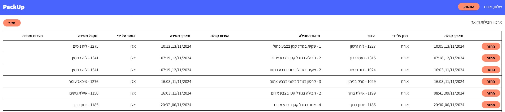
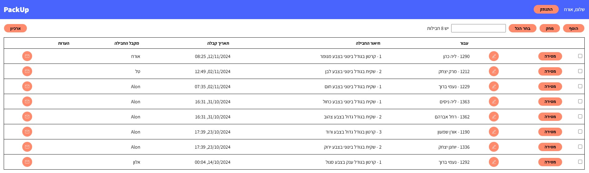
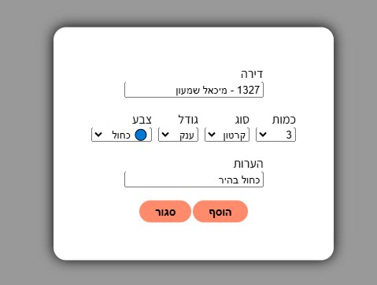

# PackUp

**PackUp** is a mail and package management system designed specifically for residential complexes. Inspired by the functionality of myTLV's package management system used in Gindi Towers, in Tel Aviv. PackUp aims to streamline the process of managing incoming packages, enhancing convenience for both residents and management. **PackUp** is the first project of many which will eventually become a full-fledged management system for residential complexes.

## Features

- **Add Packages**: Easily log new packages into the system with relevant details (e.g., resident name, delivery date, package type).
- **Remove Single Package**: Allow user to mark a single package as picked up and move it to archive.
- **Remove Multiple Packages**: Support batch removal of multiple packages, streamlining the process when several packages need to be marked as picked up.
- **Edit Existing Packages**: Enable edits to package details in case of errors or changes, like updating the recipient's information or package type.
- **Undo Removal from Archive**: Allow user to retrieve and restore packages that were mistakenly archived or marked as removed.
- **Archive Page**: Provides a dedicated page where all removed or picked-up packages are stored. Users can review package history, search archived packages, and retrieve any packages that need to be restored.

## Installation

### Step 1: Clone the Repository:

```bash
git clone https://github.com/SuperDuperAlon/PackUp.git
cd PackUp
```

### Step 2: Install Dependencies

Install the necessary dependencies for the project:

```bash
npm install
```

### Step 3: Set Up Environment Variables


Create a `.env` file in the root directory and add your own environment variables. Since sensitive keys are private, use your own credentials for secure access:

```plaintext
MONGODB_URI=<Your MongoDB connection string>
SECRET_KEY=<Your secret key for data protection>
```

### Step 4: Run the Application

Start the application server:

```bash
npm start
```

### Step 5: Access the App

Open your browser and go to `http://localhost:3000` to access the PackUp application.


## Usage

### Step 1: Login or Signup

Before accessing the system, users need to log in or register.

#### Signup:
To register, visit the **Signup Page** and provide the required information (e.g., name, email, password). Once submitted, your account will be created and you’ll be automatically logged in.

#### Login:
To log in, visit the **Login Page**, then enter your registered email and password. After successful authentication, you will be redirected to the packages dashboard.

##### Sample Login for Guests:

- **Email**: guest@pack.up
- **Password**: guest

### Step 2: Managing Packages

Once logged in, you can manage packages:

- **Add a Package**: Use the "Add Package" button to log new packages.
- **Edit a Package**: After adding a package, you can edit its details (e.g., recipient, package type, color, etc.) by selecting the package from the list and clicking the "Edit" button. Make any necessary changes and save.
- **Remove a Package**: Select a package from the list and click the "Remove" button to mark it as picked up or archived.
- **Access Archive**: Visit the **Archive Page** to view removed or archived packages.
- **Undo Package Removal**: If you removed a package, you can restore it:
  - Go to the **Archive Page**, find the removed package, and click the "Undo" or button to bring it back to the active package list.
- **Remove Multiple Packages**: 
  - Use the **Apartment Filter** to view packages for a specific apartment number.
  - Once the packages are filtered, select multiple packages and click the "Remove Selected" button to remove them at once.

### Step 3: Logging Out

To log out of the system, click on the "Logout" button located in the user menu (typically in the top right corner). User will logout automatically after an hour.


## Tech Stack

- **Frontend**: Next.js, React.js, Javascript (ES6+), Sass, Toastify
- **Backend**: Jose
- **Database**: MongoDB
- **Authentication**: JWT (JSON Web Tokens)

## Screenshots

### Dashboard


### Archive Page


### Form


## Contact

For any questions, feel free to contact [Alon Mlievski](mailto:alonmlievski@gmail.com).
